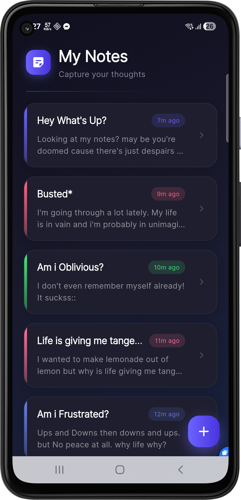
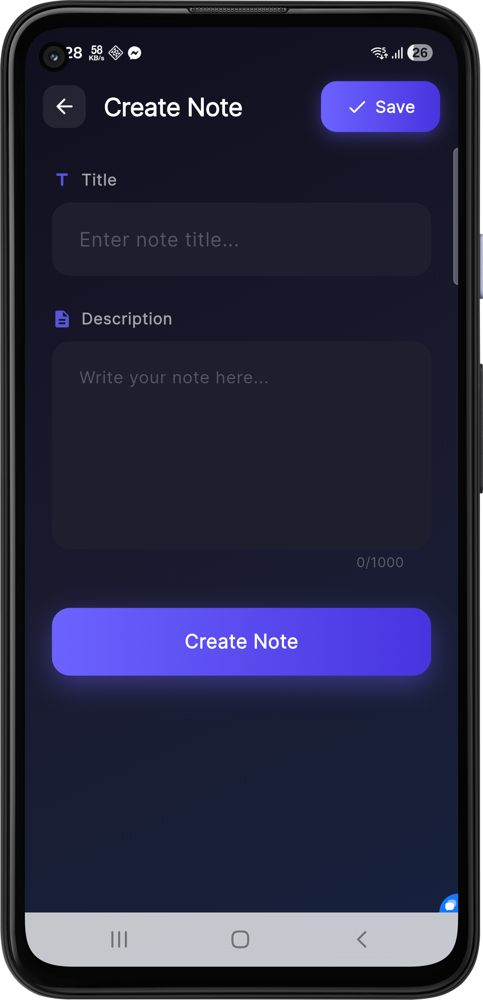

# My iNote — APK User Guide 📝

Welcome to **My iNote**, a sleek, dark-mode notes app powered by Firebase, with built-in AI features through OpenRouter. This guide walks you through installing the APK, subscribing, and using every feature.

---

## 1. Download the APK

1. Open a browser on your Android phone.
2. Visit the official site:
   **[https://mahadi-release.ruetandroiddevelopers.com/My-iNote/](https://mahadi-release.ruetandroiddevelopers.com/My-iNote/)**
3. Tap the **Download APK** button.
4. If Chrome warns *"This type of file can harm your device"*, tap **Download anyway**. This warning appears for any APK downloaded outside the Play Store.

> Direct download link:
> `https://mahadi-release.ruetandroiddevelopers.com/My-iNote/My-iNote_v1.0.apk`

---

## 2. Install the APK

Since the app isn't coming from the Play Store, Android needs one-time permission to install from your browser.

**A. Allow installation from this source**

1. Open the downloaded file (from the notification or your *Downloads* folder).
2. The system will show: *"For your security, your phone is not allowed to install unknown apps from this source."*
3. Tap **Settings**.
4. Toggle **Allow from this source** to **ON**.
5. Tap the back arrow ← to return.

**B. Install**

1. Tap **Install**.
2. Wait a few seconds.
3. Tap **Open** to launch My iNote.

> **Tip:** If installation fails, make sure your phone runs **Android 6.0 (Marshmallow)** or newer. The APK targets `minSdk 23`.

---

## 3. Subscribe (login)

My iNote is a bdapps-powered service. A small subscription is required to verify your number.

> [!IMPORTANT]
> **Subscription charge: 2.78 BDT** (VAT + SC + SD included).
> **For Robi and Airtel users only.**

### New users

1. Open the app — you land on the **Login / Subscribe** screen.
2. Enter your **Robi** or **Airtel** mobile number.
3. Tap **Subscribe / Login**.
4. You receive a **6-digit OTP** via SMS.
5. Type the OTP into the app.
6. Enter your **name** to finish profile setup.

### Returning users

1. Open the app.
2. Enter the same subscribed mobile number.
3. Tap **Subscribe / Login**.
4. You're back in — your notes are exactly where you left them.

---

## 4. Using the notes

The home screen shows all your notes in a swipeable, glass-card list.

| Action | How |
| --- | --- |
| Create a note | Tap the **+** floating button |
| Open / edit a note | Tap the card |
| Delete a note | Swipe the card **right → left** |
| Search | Use the search bar at the top |
| Profile & settings | Tap the **person icon** in the top-right |

Notes sync in real time with Firestore. Whatever you write on your phone shows up immediately on the web version at the same site.

---

## 5. AI features (optional)

My iNote ships with five AI features powered by **OpenRouter**. They are **off by default** — you choose whether to enable them.

### 5.1 Set up your API key

1. Tap the **person icon** (top-right of the notes list).
2. Tap **AI Settings**.
3. Paste your OpenRouter key (get one at [openrouter.ai](https://openrouter.ai) → *Keys*).
4. Tap **Save**.

Your key is stored on the device using Android's EncryptedSharedPreferences. It is never sent to My iNote servers.

> Want to skip OpenRouter entirely? Set the **Proxy base URL** to your own backend. Then everyone uses your server's key, not their own.

### 5.2 The five features

| Feature | Where | What it does |
| --- | --- | --- |
| **Chat with note** | AI menu (in editor) | Stream a conversation constrained to the current note's content |
| **Task extractor** | AI menu (in editor) | Pulls actionable tasks out of the note with priorities (Low / Medium / High) |
| **Brainstorm** | AI menu (in editor) | Generates grouped ideas for the note, rendered as Markdown |
| **Continue writing** | Editor toolbar | Streams text right at your cursor while you type, matching the note's tone |
| **Semantic search** | Search bar on notes list | Embeds your query and every note, ranks by similarity, shows `% match` badges |

To access the first three, open a note, tap the **sparkles icon** (✨) in the app bar.

---

## 6. Logging out vs. unsubscribing

Open **Profile** from the home screen.

- **Logout** — clears the local session on this device. Your **bdapps subscription stays active**, so you can log back in on the same number and pick up where you left off.
- **Unsubscribe** — cancels the bdapps subscription itself. You will be logged out and need to resubscribe to use My iNote again.

> [!TIP]
> Switching to a new phone? Tap **Logout** on the old one, then **Subscribe / Login** on the new one with the same number — your notes follow you.

---

## 7. Troubleshooting

**"App not installed"**
- An older copy may still be installed. Uninstall My iNote from *Settings → Apps*, then re-install.

**"Couldn't send OTP"**
- Confirm you're using a **Robi** or **Airtel** SIM.
- Make sure you have SMS reception and at least 2.78 BDT balance.
- Wait 60 seconds and try again — the OTP endpoint rate-limits.

**"Invalid API key" / "401 Unauthorized" (AI features)**
- Open **Profile → AI Settings**, paste the key again, and tap **Save**.
- Confirm the key starts with `sk-or-v1-` on [openrouter.ai](https://openrouter.ai).

**Semantic search returns nothing**
- The app only ranks notes that already have an embedding stored. Save the note once (or edit it) — the embedding is generated automatically on save.

---

## 8. Screenshots

  
  

---

*Enjoy writing with My iNote ✨*